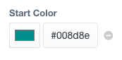
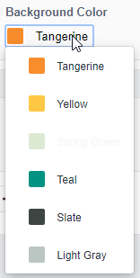

# Hue

_A slightly better color picker for CraftCMS_

by Michael Rog [https://topshelfcraft.com](https://topshelfcraft.com), Aaron Waldon, and contributors


## TL;DR.

Hue has two fieldtypes: **Hue Color Picker** and **Hue Color Palette**

The **Hue Color Picker** fieldtype works almost identically to Craft's native Color field, with some added bonuses:

- You can directly edit the color code as text.
- You can specify a default color in the field settings.
- You can clear (i.e. un-set) field values
- You can set the default color to be empty.
- The `ColorModel` gives you access to nice helper variables.




The **Hue Color Palette** fieldtype works a lot like (and is inspired by) the [Button Box](https://github.com/supercool/buttonbox) color fields, with a few advantages.

- You can update your colors in your config and they will instantly be in sync anywhere the field is being used.
- You can disable a color so that it cannot be selected anymore, but still allow its existing data to be available.
- You can change the value, label, and hex color information at any time, and it updates everywhere.




* * *


## Working with Hue Color Picker fields

When you access a Hue Color Picker field in your templates, its value will either be `null` (if there is no color set), or a _Hue_ColorModel_.


## Working with Hue Color Palette fields

Create a `craft/config/hue.php` config file, and define your color palettes and their colors:

```php
<?php

return [
    'palettes' => [
        'Bar Palette' => [
            'Color 1' => [
                'value' => 'tangerine',
                'label' => 'Tangerine',
                'hex' => '#F88D2D',
            ],
            'Color 3' => [
                'value' => 'springGreen',
                'label' => 'Spring Green',
                'hex' => '#71A850'
            ],
        ],
        'Backgrounds' => [
            'bg1' => [
               'value' => 'teal',
               'label' => 'Teal',
               'hex' => '#009383'
            ],
            'bg2' => [
                'value' => 'transparent',
                'label' => 'None',
                'hex' => '', //null is transparent
                'disabled' => true //disabled will make the color unselectable
            ]
        ]
    ]
];
```

When you create your Hue Color Palette field, you can select which palette you would like to use. The palette's colors will now be available for selection wherever the field is used.

When you access a Hue Color Palette field in your templates, its value will either be `null` (if there is no color set), or a _Hue_ColorPaletteColorModel_.

If you output just the field, it's `value` will be returned. For example, this:

```twig
{{ myColorPaletteField ?? 'someDefault' }}
```

is the same as:

```twig
{{ myColorPaletteField.value ?? 'someDefault' }}
```


## Using Hue without a field

You can create a _Hue_ColorModel_ instance in your templates and work with it just like you would a Hue field. To create a Hue instance in your template, simply pass a color to the `craft.hue.createColorFromHex( '#ff80ff' )` method.

Here's an example to determine whether a hex color is light or dark:

```twig


<p>The color "{{ hex }}" is {{ hueColor.luma > 0.5 ? 'light' : 'dark') }}.</p>
```


## Hue_ColorModel


### Returned By

- A Hue Color Picker fieldtype
- The `craft.hue.createColorFromHex` template method
- The `.color` property of a Hue Color Palette field


### Methods/Properties

* **`getHex()` / `.hex`** - Returns the _string_ representation of the color in hexidecimal format, including the `#` at the beginning.
* **`getRgb()` / `.rgb`** - Returns the _string_ representation of the color in RGB format, i.e. `"0,255,0"` for blue.
* **`getRed()` / `.red`** - Returns the _numeric_ value of the red channel, from 0-255.
* **`getGreen()` / `.green`** - Returns the _numeric_ value of the green channel, from 0-255.
* **`getBlue()` / `.blue`** - Returns the _numeric_ value of the blue channel, from 0-255.
* **`luma()` / `.luma`** - Returns the _numeric_ brightness of an image, from 0-1. Values closer to 0 are darker, closer to 1 are lighter.


## Hue_ColorPaletteColorModel


### Returned By

- A Hue Color Palette field


### Methods/Properties

* **`.key`** - The key used to define the palette color.
* **`.value`** - The palette color's value, as set in the config.
* **`.label`** - The palette color's label, as set in the config.
* **`.hex`** - The palette color's hex value, as set in the config.
* **`.disabled`** - Whether or not the palette color is disabled, as set in the config.
* **`.color`** - Returns a Hue_ColorModel that is created from the palette color's hex value.


## What are the system requirements?

Craft 2.5+ and PHP 5.4+


## I found a bug.

Please open a GitHub Issue, submit a PR to the `dev` branch, or just email me to let me know.


* * *

## Contributors:

  - [Michael Rog](http://michaelrog.com) / @michaelrog
  - [Steve V](https://github.com/dubcanada) / @dubcanada
  - [Aaron Waldon](https://github.com/aaronwaldon) / @aaronwaldon
