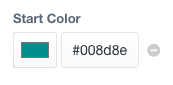

# Hue

_A slightly better color picker for CraftCMS_

by Michael Rog  
[http://topshelfcraft.com](http://topshelfcraft.com)

### TL;DR.

The _Hue_ fieldtype works almost identically to Craft's native Color field, with some added bonuses:

- You can directly edit the color code as text.
- You can specify a default color in the field settings.
- You can clear (i.e. un-set) field values
- You can set the default color to be empty.
- The `ColorModel` gives you access to nice helper variables.

* * *

### Working with Hue fields

When you access a Hue field in your templates, its value will either be `null` (if there is no color set), or a _ColorModel_.

### ColorModel properties

A _ColorModel_ has the following methods/properties:

##### `getHex()` / `.hex`

Returns the _string_ representation of the color in hexidecimal format, including the `#` at the beginning.

##### `getRgb()` / `.rgb`

Returns the _string_ representation of the color in RGB format, i.e. `"0,255,0"` for blue.

##### `getRed()` / `.red`

Returns the _numeric_ value of the red channel, from 0-255.

##### `getGreen()` / `.green`

Returns the _numeric_ value of the green channel, from 0-255.

##### `getBlue()` / `.blue`

Returns the _numeric_ value of the blue channel, from 0-255.

### What are the system requirements?

Craft 2.5+ and PHP 5.4+

### I found a bug.

Please open a GitHub Issue, submit a PR, or just email me to let me know.

* * *

#### Contributors:

  - Plugin development: [Michael Rog](http://michaelrog.com) / @michaelrog